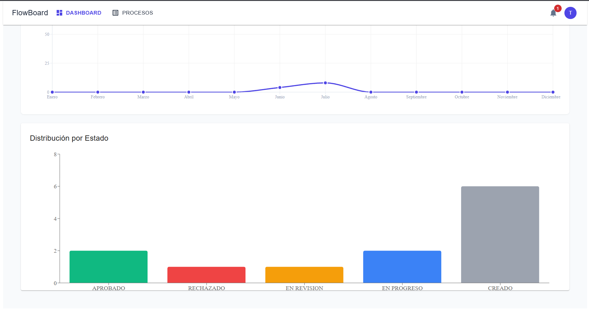
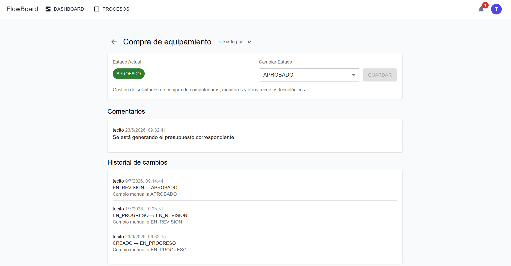

# FlowBoard (full stack)

## Descripción

Aplicación web fullstack para la **gestión, seguimiento y colaboración en flujos de trabajo administrativos**. Diseñada con enfoque en trazabilidad, control de estados, seguridad basada en roles y analítica visual.

El directorio agrupa ambas aplicaciones (backend y frontend), cada una con su propio README.md con información detallada.

## Tecnologías utilizadas

**Frontend:** React 18, Vite 5, Material UI v6, React Router, Axios, Recharts.

**Backend:** Spring Boot 4.0.5, Java 21, Spring Security 7, JPA/Hibernate, jjwt.

**Base de Datos:** PostgreSQL 16.

**DevOps:** Docker Compose, Maven, ESLint, Prettier.

## Instalación y ejecución

Hay dos maneras de ejecutar la aplicación: **localmente** o con **Docker**.

## Opción 1: Docker Completo

Levanta frontend + backend + base de datos con un solo comando.
Requisitos: Docker & Docker Compose.

### Clonar el repositorio

```bash
git clone https://github.com/abril-ruiz/flowboard-app.git
cd flowboard-app
```

### Configurar variables de entorno

```bash
cp .env.example .env
# Edita .env con tus credenciales
```

### Levantar todo el stack

```bash
docker compose up --build
```

### Acceder a la aplicación

_Frontend:_ http://localhost

_Backend API:_ http://localhost:8080/api

_Swagger UI:_ http://localhost:8080/swagger-ui/index.html

> [!TIP]
> Comandos útiles de Docker:
>
> docker compose down -> Detiene contenedores (conserva datos).
>
> docker compose down -v -> Detiene y borra el volumen de BD.
>
> docker compose ps -> Ver estado de contenedores y puertos.

## Opción 2: Desarrollo local

Requisitos: Java 21+, Node.js 20+ & npm, PostgreSQL 16+

### Clonar repositorio y configurar variables

```bash
git clone https://github.com/abril-ruiz/flowboard-app.git
cd flowboard-app
cp .env.example .env
```

### Configurar la base de datos PostgreSQL

- Crea en PostgreSQL una base de datos vacía (por ejemplo `flowboard_db`)
- Ajusta las propiedades de conexión en `src/main/resources/application-local.properties` o en `application.properties`:

```bash
spring.datasource.url=jdbc:postgresql://localhost:5432/flowboard_db
spring.datasource.username=tu_usuario
spring.datasource.password=tu_contraseña
spring.jpa.hibernate.ddl-auto=update
```

### Iniciar backend (terminal 1)

```bash
cd backend/flowboard
mvn spring-boot:run
# si non funciona, usar: mvn spring-boot:run -Dspring-boot.run.profiles=local
```

### Iniciar frontend (terminal 2)

```bash
cd frontend/flowboard-ui
npm install
npm run dev
```

### Acceder

_Frontend:_ http://localhost:5173
_Backend:_ http://localhost:8080

## Configuración de variables de entorno

Este proyecto utiliza archivos `.env` separados para cada servicio:

- `/.env`: configuración de Docker Compose (PostgreSQL)
- `frontend/.env`: configuración del cliente (VITE).
- `backend/.env`: configuración del servidor (ej. conexión a la base de datos).

Antes de ejecutar `docker-compose up`, copia cada `.env.example` a `.env` y ajusta los valores según tu entorno.

> [!NOTE]
> Para detalles de instalación y configuración, consulta las instrucciones específicas:

> - [Backend (`backend/flowboard/`)](backend/flowboard/README.md)
> - [Frontend (`frontend/flowboard-ui/`)](frontend/flowboard-ui/README.md)

## Estructura del Proyecto

```
flowboard-app/              # raíz del proyecto
├── backend/flowboard       # API REST (Spring Boot)
├── frontend/flowboard-ui   # SPA (React + Vite)
├── docker-compose.yml      # Orquesta API + PostgreSQL en contenedores
├── .env.example                # Template principal de variables sensibles
├── README.md               # Este archivo
└── .gitignore
```

## Funcionalidades

- Roles de usuario (`ADMIN` / `USER`) con autorización declarativa
- Contraseñas hasheadas con BCrypt
- Máquina de estados con validación estricta de transiciones (`CREADO` → `EN_PROGRESO` → `EN_REVISION` → `APROBADO`/`RECHAZADO`)
- Colaboración en tiempo real: comentarios, etiquetas y filtros avanzados
- Dashboard analítico con métricas y gráficos interactivos
- Sistema de notificaciones con estado de lectura y gestión por localStorage

## Preview

### Login & Registro

<p align="center">
  <video src="screenshots/login_record.mp4" width="85%" autoplay loop muted></video>
</p>

Interfaz de autenticación con diseño moderno, validación en tiempo real y acceso rápido a registro.

### Dashboard

<p align="center">
  
</p>

Vista principal con gráfico de barras interactivo con distribución por estados.

### Procesos

<p align="center">
  <video src="screenshots/process.mp4" width="85%" autoplay loop muted></video>
</p>

Tabla interactiva con filtros por estado, paginación y acciones rápidas.

### Detalle de proceso

<p align="center">
  
</p>

Vista completa con selector de estados, comentarios y auditoría de cambios.

## Autor

- Abril Ruiz
- [Email](mailto:abrilvalentinaruiz516@gmail.com)
